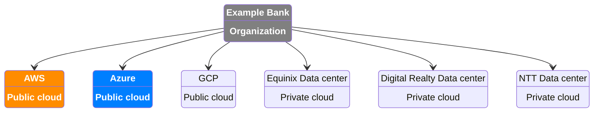
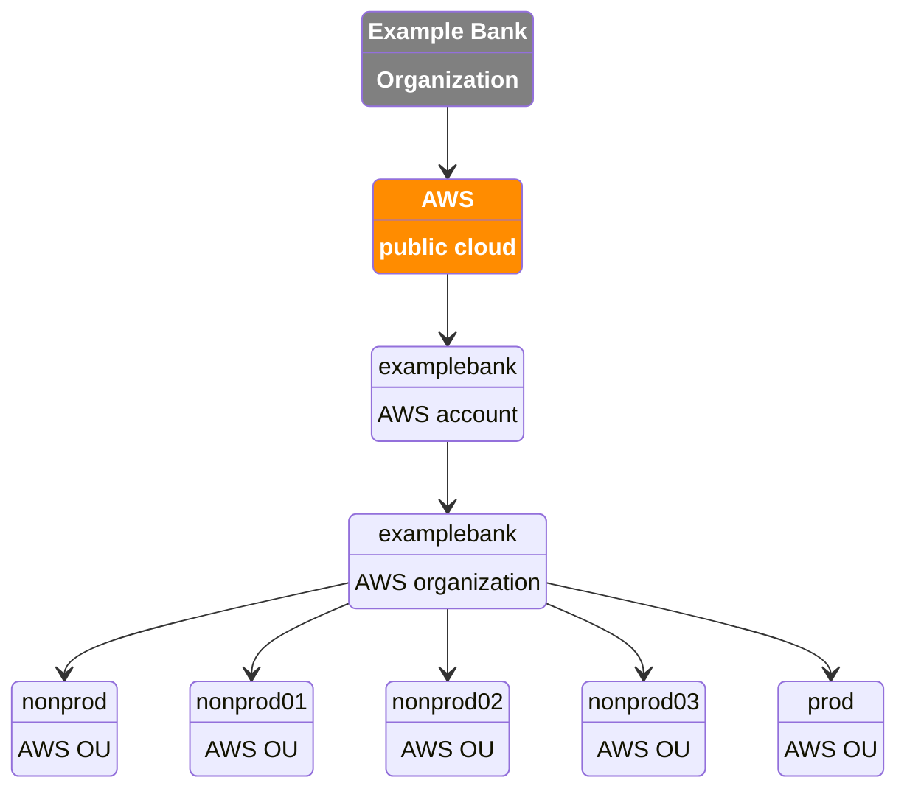
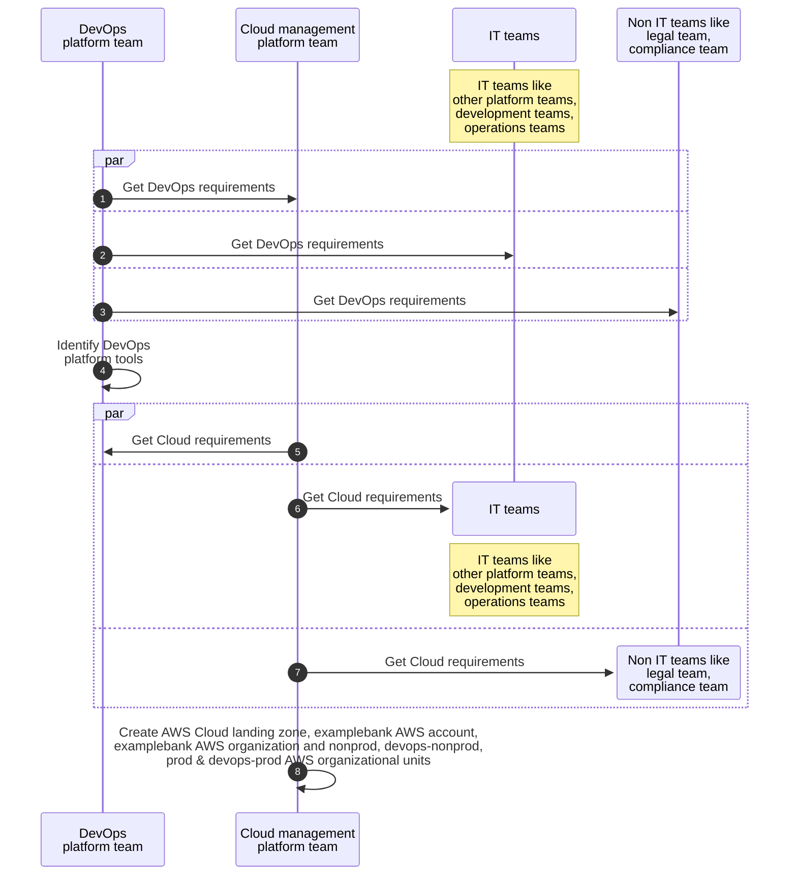
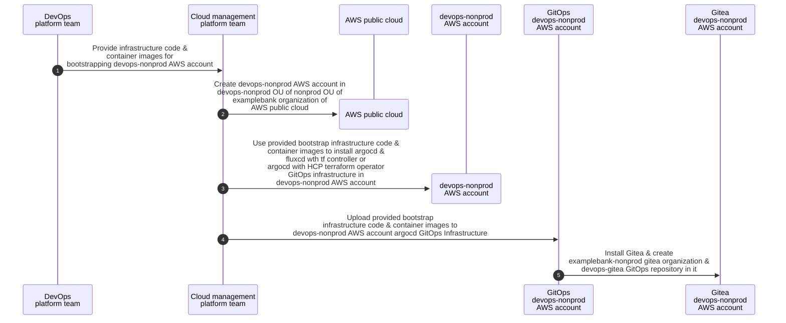
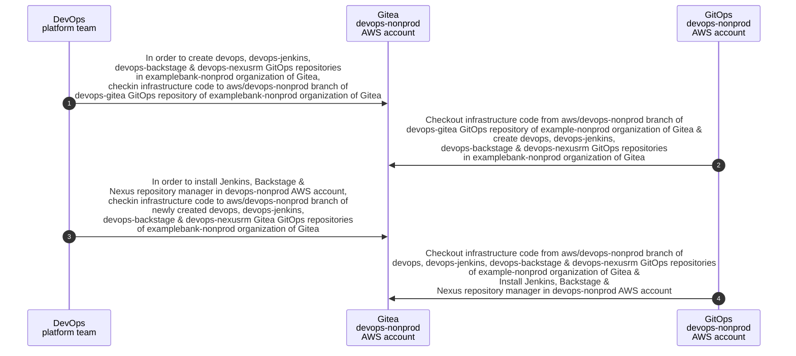
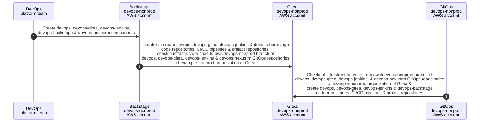

# Organization

# AWS Public Cloud

## AWS Organization

## AWS Organizational Units

### nonprod

```mermaid
stateDiagram-v2
    example_bank_organization : Example Bank 
    example_bank_organization : Organization
    aws_public_cloud : AWS
    aws_public_cloud : public cloud
    example_bank_organization --> aws_public_cloud
    examplebank_aws_account : examplebank
    examplebank_aws_account : AWS account
    aws_public_cloud --> examplebank_aws_account
    examplebank_aws_organization : examplebank
    examplebank_aws_organization : AWS organization
    examplebank_aws_account --> examplebank_aws_organization
    nonprod_aws_ou : nonprod AWS OU
    examplebank_aws_organization --> nonprod_aws_ou
        state nonprod_aws_ou {
            compute_nonprod_aws_ou : compute-nonprod AWS OU
            state compute_nonprod_aws_ou {
                direction LR
                compute_nonprod_aws_account : compute-nonprod
                compute_nonprod_aws_account : AWS account (GitOps)
                compute_comptest_aws_account : compute-comptest
                compute_comptest_aws_account : AWS account
                compute_inttest_aws_account : compute-inttest
                compute_inttest_aws_account : AWS account
                compute_e2etest_aws_account : compute-e2etest
                compute_e2etest_aws_account : AWS account
                compute_perftest_aws_account : compute-perftest
                compute_perftest_aws_account : AWS account
            }
            storage_nonprod_aws_ou : storage-nonprod AWS OU
            state storage_nonprod_aws_ou {
                direction LR
                storage_nonprod_aws_account : storage-nonprod
                storage_nonprod_aws_account : AWS account (GitOps)
                storage_comptest_aws_account : storage-comptest
                storage_comptest_aws_account : AWS account
                storage_inttest_aws_account : storage-inttest
                storage_inttest_aws_account : AWS account
                storage_e2etest_aws_account : storage-e2etest
                storage_e2etest_aws_account : AWS account
                storage_perftest_aws_account : storage-perftest
                storage_perftest_aws_account : AWS account
            }
            network_nonprod_aws_ou : network-nonprod AWS OU
            state network_nonprod_aws_ou {
                direction LR
                network_nonprod_aws_account : network-nonprod
                network_nonprod_aws_account : AWS account (GitOps)
                network_comptest_aws_account : network-comptest
                network_comptest_aws_account : AWS account
                network_inttest_aws_account : network-inttest
                network_inttest_aws_account : AWS account
                network_e2etest_aws_account : network-e2etest
                network_e2etest_aws_account : AWS account
                network_perftest_aws_account : network-perftest
                network_perftest_aws_account : AWS account
            }
            security_nonprod_aws_ou : security-nonprod AWS OU
            state security_nonprod_aws_ou {
                direction LR
                security_nonprod_aws_account : security-nonprod
                security_nonprod_aws_account : AWS account (GitOps)
                security_comptest_aws_account : security-comptest
                security_comptest_aws_account : AWS account
                security_inttest_aws_account : security-inttest
                security_inttest_aws_account : AWS account
                security_e2etest_aws_account : security-e2etest
                security_e2etest_aws_account : AWS account
                security_perftest_aws_account : security-perftest
                security_perftest_aws_account : AWS account
            }
            ocm_nonprod_aws_ou : ocm-nonprod AWS OU
            state ocm_nonprod_aws_ou {
                direction LR
                ocm_nonprod_aws_account : ocm-nonprod
                ocm_nonprod_aws_account : AWS account (GitOps)
                ocm_comptest_aws_account : ocm-comptest
                ocm_comptest_aws_account : AWS account
                ocm_inttest_aws_account : ocm-inttest
                ocm_inttest_aws_account : AWS account
                ocm_e2etest_aws_account : ocm-e2etest
                ocm_e2etest_aws_account : AWS account
                ocm_perftest_aws_account : ocm-perftest
                ocm_perftest_aws_account : AWS account
            }
            devops_nonprod_aws_ou : devops-nonprod AWS OU
            state devops_nonprod_aws_ou {
                direction LR
                devops_nonprod_aws_account : devops-nonprod
                devops_nonprod_aws_account : AWS account (GitOps)
                devops_comptest_aws_account : devops-comptest
                devops_comptest_aws_account : AWS account
                devops_inttest_aws_account : devops-inttest
                devops_inttest_aws_account : AWS account
                devops_e2etest_aws_account : devops-e2etest
                devops_e2etest_aws_account : AWS account
                devops_perftest_aws_account : devops-perftest
                devops_perftest_aws_account : AWS account
            }
            middleware_nonprod_aws_ou : middleware-nonprod AWS OU
            state middleware_nonprod_aws_ou {
                direction LR
                middleware_nonprod_aws_account : middleware-nonprod
                middleware_nonprod_aws_account : AWS account (GitOps)
                middleware_comptest_aws_account : middleware-comptest
                middleware_comptest_aws_account : AWS account
                middleware_inttest_aws_account : middleware-inttest
                middleware_inttest_aws_account : AWS account
                middleware_e2etest_aws_account : middleware-e2etest
                middleware_e2etest_aws_account : AWS account
                middleware_perftest_aws_account : middleware-perftest
                middleware_perftest_aws_account : AWS account
            }
            database_nonprod_aws_ou : database-nonprod AWS OU
            state database_nonprod_aws_ou {
                direction LR
                database_nonprod_aws_account : database-nonprod
                database_nonprod_aws_account : AWS account (GitOps)
                database_comptest_aws_account : database-comptest
                database_comptest_aws_account : AWS account
                database_inttest_aws_account : database-inttest
                database_inttest_aws_account : AWS account
                database_e2etest_aws_account : database-e2etest
                database_e2etest_aws_account : AWS account
                database_perftest_aws_account : database-perftest
                database_perftest_aws_account : AWS account
            }
            observability_nonprod_aws_ou : observability-nonprod AWS OU
            state observability_nonprod_aws_ou {
                direction LR
                observability_nonprod_aws_account : observability-nonprod
                observability_nonprod_aws_account : AWS account (GitOps)
                observability_comptest_aws_account : observability-comptest
                observability_comptest_aws_account : AWS account
                observability_inttest_aws_account : observability-inttest
                observability_inttest_aws_account : AWS account
                observability_e2etest_aws_account : observability-e2etest
                observability_e2etest_aws_account : AWS account
                observability_perftest_aws_account : observability-perftest
                observability_perftest_aws_account : AWS account
            }
            finops_nonprod_aws_ou : finops-nonprod AWS OU
            state finops_nonprod_aws_ou {
                direction LR
                finops_nonprod_aws_account : finops-nonprod
                finops_nonprod_aws_account : AWS account (GitOps)
                finops_comptest_aws_account : finops-comptest
                finops_comptest_aws_account : AWS account
                finops_inttest_aws_account : finops-inttest
                finops_inttest_aws_account : AWS account
                finops_e2etest_aws_account : finops-e2etest
                finops_e2etest_aws_account : AWS account
                finops_perftest_aws_account : finops-perftest
                finops_perftest_aws_account : AWS account
            }
        }
```

### nonprod01, nonprod02, nonprod03

```mermaid
stateDiagram-v2
    example_bank_organization : Example Bank 
    example_bank_organization : Organization
    aws_public_cloud : AWS
    aws_public_cloud : public cloud
    example_bank_organization --> aws_public_cloud
    examplebank_aws_account : examplebank
    examplebank_aws_account : AWS account
    aws_public_cloud --> examplebank_aws_account
    examplebank_aws_organization : examplebank
    examplebank_aws_organization : AWS organization
    examplebank_aws_account --> examplebank_aws_organization
        nonprod01_aws_ou : nonprod01 AWS OU
        examplebank_aws_organization --> nonprod01_aws_ou
        state nonprod01_aws_ou {
            orgunit01_nonprod01_aws_ou : orgunit01-nonprod01 AWS OU
            state orgunit01_nonprod01_aws_ou {
                direction LR
                orgunit01_comptest01_aws_account : orgunit01-comptest01
                orgunit01_comptest01_aws_account : AWS account
                orgunit01_inttest01_aws_account : orgunit01-inttest01
                orgunit01_inttest01_aws_account : AWS account
                orgunit01_e2etest01_aws_account : orgunit01-e2etest01
                orgunit01_e2etest01_aws_account : AWS account
                orgunit01_perftest01_aws_account : orgunit01-perftest01
                orgunit01_perftest01_aws_account : AWS account (GitOps)
            }
            orgunit02_nonprod01_aws_ou : orgunit02-nonprod01 AWS OU
            state orgunit02_nonprod01_aws_ou {
                direction LR
                orgunit02_comptest01_aws_account : orgunit02-comptest01
                orgunit02_comptest01_aws_account : AWS account
                orgunit02_inttest01_aws_account : orgunit02-inttest01
                orgunit02_inttest01_aws_account : AWS account
                orgunit02_e2etest01_aws_account : orgunit02-e2etest01
                orgunit02_e2etest01_aws_account : AWS account
                orgunit02_perftest01_aws_account : orgunit02-perftest01
                orgunit02_perftest01_aws_account : AWS account (GitOps)
            }
        }
        nonprod02_aws_ou : nonprod02 AWS OU
        examplebank_aws_organization --> nonprod02_aws_ou
        state nonprod02_aws_ou {
            orgunit01_nonprod02_aws_ou : orgunit01-nonprod02 AWS OU
            state orgunit01_nonprod02_aws_ou {
                direction LR
                orgunit01_comptest02_aws_account : orgunit01-comptest02
                orgunit01_comptest02_aws_account : AWS account
                orgunit01_inttest02_aws_account : orgunit01-inttest02
                orgunit01_inttest02_aws_account : AWS account
                orgunit01_e2etest02_aws_account : orgunit01-e2etest02
                orgunit01_e2etest02_aws_account : AWS account
                orgunit01_perftest02_aws_account : orgunit01-perftest02
                orgunit01_perftest02_aws_account : AWS account (GitOps)
            }
            orgunit02_nonprod02_aws_ou : orgunit02-nonprod02 AWS OU
            state orgunit02_nonprod02_aws_ou {
                direction LR
                orgunit02_comptest02_aws_account : orgunit02-comptest02
                orgunit02_comptest02_aws_account : AWS account
                orgunit02_inttest02_aws_account : orgunit02-inttest02
                orgunit02_inttest02_aws_account : AWS account
                orgunit02_e2etest02_aws_account : orgunit02-e2etest02
                orgunit02_e2etest02_aws_account : AWS account
                orgunit02_perftest02_aws_account : orgunit02-perftest02
                orgunit02_perftest02_aws_account : AWS account (GitOps)
            }
        }
        nonprod03_aws_ou : nonprod03 AWS OU
        examplebank_aws_organization --> nonprod03_aws_ou
        state nonprod03_aws_ou {
            orgunit01_nonprod03_aws_ou : orgunit01-nonprod03 AWS OU
            state orgunit01_nonprod03_aws_ou {
                direction LR
                orgunit01_comptest03_aws_account : orgunit01-comptest03
                orgunit01_comptest03_aws_account : AWS account
                orgunit01_inttest03_aws_account : orgunit01-inttest03
                orgunit01_inttest03_aws_account : AWS account
                orgunit01_e2etest03_aws_account : orgunit01-e2etest03
                orgunit01_e2etest03_aws_account : AWS account
                orgunit01_perftest03_aws_account : orgunit01-perftest03
                orgunit01_perftest03_aws_account : AWS account (GitOps)
            }
            orgunit02_nonprod03_aws_ou : orgunit02-nonprod03 AWS OU
            state orgunit02_nonprod03_aws_ou {
                direction LR
                orgunit02_comptest03_aws_account : orgunit02-comptest03
                orgunit02_comptest03_aws_account : AWS account
                orgunit02_inttest03_aws_account : orgunit02-inttest03
                orgunit02_inttest03_aws_account : AWS account
                orgunit02_e2etest03_aws_account : orgunit02-e2etest03
                orgunit02_e2etest03_aws_account : AWS account
                orgunit02_perftest03_aws_account : orgunit02-perftest03
                orgunit02_perftest03_aws_account : AWS account (GitOps)
            }
        }
```

### prod

```mermaid
stateDiagram-v2
    example_bank_organization : Example Bank 
    example_bank_organization : Organization
    aws_public_cloud : AWS
    aws_public_cloud : public cloud
    example_bank_organization --> aws_public_cloud
    examplebank_aws_account : examplebank
    examplebank_aws_account : AWS account
    aws_public_cloud --> examplebank_aws_account
    examplebank_aws_organization : examplebank
    examplebank_aws_organization : AWS organization
    examplebank_aws_account --> examplebank_aws_organization
        prod_aws_ou : prod AWS OU
        examplebank_aws_organization --> prod_aws_ou
        state prod_aws_ou {
            compute_prod_aws_ou : compute-prod AWS OU
            state compute_prod_aws_ou {
                direction LR
                compute_prod_aws_account : compute-prod
                compute_prod_aws_account : AWS account (GitOps)
                compute_dr_aws_account : compute-dr
                compute_dr_aws_account : AWS account (GitOps)  
            }
            storage_prod_aws_ou : storage-prod AWS OU
            state storage_prod_aws_ou {
                direction LR
                storage_prod_aws_account : storage-prod
                storage_prod_aws_account : AWS account (GitOps)
                storage_dr_aws_account : storage-dr
                storage_dr_aws_account : AWS account (GitOps)  
            }
            network_prod_aws_ou : network-prod AWS OU
            state network_prod_aws_ou {
                direction LR
                network_prod_aws_account : network-prod
                network_prod_aws_account : AWS account (GitOps)
                network_dr_aws_account : network-dr
                network_dr_aws_account : AWS account (GitOps)  
            }
            security_prod_aws_ou : security-prod AWS OU
            state security_prod_aws_ou {
                direction LR
                security_prod_aws_account : security-prod
                security_prod_aws_account : AWS account (GitOps)
                security_dr_aws_account : security-dr
                security_dr_aws_account : AWS account (GitOps)  
            }
            ocm_prod_aws_ou : ocm-prod AWS OU
            state ocm_prod_aws_ou {
                direction LR
                ocm_prod_aws_account : ocm-prod
                ocm_prod_aws_account : AWS account (GitOps)
                ocm_dr_aws_account : ocm-dr
                ocm_dr_aws_account : AWS account (GitOps)  
            }
            devops_prod_aws_ou : devops-prod AWS OU
            state devops_prod_aws_ou {
                direction LR
                devops_prod_aws_account : devops-prod
                devops_prod_aws_account : AWS account (GitOps)
                devops_dr_aws_account : devops-dr
                devops_dr_aws_account : AWS account (GitOps)  
            }
            middleware_prod_aws_ou : middleware-prod AWS OU
            state middleware_prod_aws_ou {
                direction LR
                middleware_prod_aws_account : middleware-prod
                middleware_prod_aws_account : AWS account (GitOps)
                middleware_dr_aws_account : middleware-dr
                middleware_dr_aws_account : AWS account (GitOps)  
            }
            database_prod_aws_ou : database-prod AWS OU
            state database_prod_aws_ou {
                direction LR
                database_prod_aws_account : database-prod
                database_prod_aws_account : AWS account (GitOps)
                database_dr_aws_account : database-dr
                database_dr_aws_account : AWS account (GitOps)  
            }
            observability_prod_aws_ou : observability-prod AWS OU
            state observability_prod_aws_ou {
                direction LR
                observability_prod_aws_account : observability-prod
                observability_prod_aws_account : AWS account (GitOps)
                observability_dr_aws_account : observability-dr
                observability_dr_aws_account : AWS account (GitOps)  
            }
            finops_prod_aws_ou : finops-prod AWS OU
            state finops_prod_aws_ou {
                direction LR
                finops_prod_aws_account : finops-prod
                finops_prod_aws_account : AWS account (GitOps)
                finops_dr_aws_account : finops-dr
                finops_dr_aws_account : AWS account (GitOps)  
            }
            orgunit01_prod_aws_ou : orgunit01-prod AWS OU
            state orgunit01_prod_aws_ou {
                direction LR
                orgunit01_prod_aws_account : orgunit01-prod
                orgunit01_prod_aws_account : AWS account (GitOps)
                orgunit01_dr_aws_account : orgunit01-dr
                orgunit01_dr_aws_account : AWS account (GitOps) 
            }
            orgunit02_prod_aws_ou : orgunit02-prod AWS OU
            state orgunit02_prod_aws_ou {
                direction LR
                orgunit02_prod_aws_account : orgunit02-prod
                orgunit02_prod_aws_account : AWS account (GitOps)
                orgunit02_dr_aws_account : orgunit02-dr
                orgunit02_dr_aws_account : AWS account (GitOps) 
            }
        }
```

# 000

# 000

# 000

# 000

# Bootstrap code for orgunit01 and other OUs will be checkin to code repository by DevOps platform team and CI pipeline will checkin it to the GitOps repository of that OU and no one needs to manually provide it to the Cloud management platform team. They can take it from the bootstrap folder of the account branch of the GitOps repository.